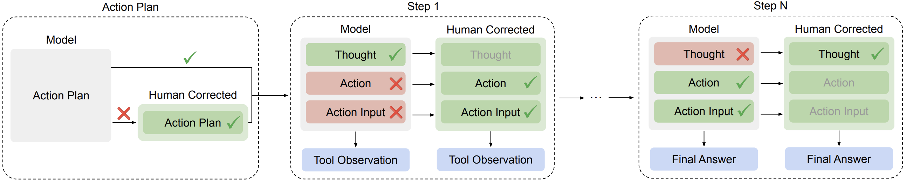

# ToolComp Evaluation

This repository contains code for running and evaluating language models on the ToolComp benchmark, which tests a model's ability to use tools effectively.




<div align="center">

[📄 Paper](https://arxiv.org/abs/2501.01290) | [🤗 Dataset](https://huggingface.co/datasets/vaskarnath/toolcomp) | [🏆 Chat Leaderboard](https://scale.com/leaderboard/tool_use_chat) | [🏆 Enterprise Leaderboard](https://scale.com/leaderboard/tool_use_enterprise)

</div>

## Prerequisites

Before running the evaluation, ensure you have:

1. Installed all required dependencies:
   ```bash
   pip install -r requirements.txt
   ```

2. Set up API keys via environment variables or a local .env file

## Running the Evaluation

The main evaluation script is located in the `scripts` directory. It runs the model against the ToolComp benchmark and then grades the results.

### Quick Start

To run the evaluation with default settings:

```bash
cd /path/to/toolcomp
bash scripts/run_toolcomp.sh
```

### Configure API Keys

This project looks for API keys in standard environment variables and also supports a local `.env` file (loaded automatically via `python-dotenv`). Create a `.env` file at the repo root by copying the example and filling in your values:

```bash
cp env.example .env
# then edit .env
```

Supported keys:

- LiteLLM proxy and providers
  - `LITE_LLM_API_KEY`
  - `OPENAI_API_KEY`
  - `ANTHROPIC_API_KEY`
  - `GEMINI_API_KEY`
- Tools
  - `SEARCHAPI_API_KEY` (or legacy `RESEARCH_SEARCHAPI_API_KEY`)
  - `ALPHA_VANTAGE_API_KEY` (or legacy `RESEARCH_ALPHA_VANTAGE_API_KEY`)
  - `OPENWEATHER_API_KEY` (or legacy `RESEARCH_OPENWEATHER_API_KEY`)
  - `WOLFRAM_ALPHA_API_KEY` (or legacy `RESEARCH_WOLFRAM_ALPHA_API_KEY`)
  - `SPHERE_ENGINE_API_KEY` (Sphere Engine Compilers; only needed if you use the code execution tool)

Notes:
- If `LITE_LLM_API_KEY` is set, it will be used as a fallback for missing `OPENAI_API_KEY` and `ANTHROPIC_API_KEY` during runtime.

### Script Configuration

The `run_toolcomp.sh` script sets up the following:

1. Environment variables:
   - `PYTHONPATH=.` - Sets the Python path to include the current directory
   - `AWS_PROFILE=ml-worker` - Sets the AWS profile to use for AWS services

2. Configuration parameters:
   - `MODEL_NAME` - The model to evaluate
   - `INFERENCE_STRATEGY` - The inference strategy to use (options: native or react)

3. Runs the main evaluation:
   ```bash
   python toolcomp/main.py \
       --inference_strategy $INFERENCE_STRATEGY \
       --policy_model_str $MODEL_NAME \
       --policy_max_tokens 4096 \
       --policy_temperature 1 \
       --policy_stop "End Action" \
       --policy_stop "End Action\n" \
       --policy_stop "\nEnd Action" \
       --input_file toolcomp/full_toolcomp_data.jsonl \
       --num_retries 5 \
       --num_full_retries 3 \
       --max_depth 30 \
       --num_workers 8 \
       --output_dir toolcomp/outputs/$MODEL_NAME-$INFERENCE_STRATEGY
   ```

4. Grades the evaluation results:
   ```bash
   python toolcomp/grade/llm_grade.py \
       --input_file toolcomp/outputs/$MODEL_NAME-$INFERENCE_STRATEGY/native_generations.json \
       --output_dir toolcomp/outputs/$MODEL_NAME-$INFERENCE_STRATEGY \
       --num_workers 30
   ```

### Customizing the Evaluation

To customize the evaluation, you can modify the following parameters in the script:

- `MODEL_NAME`: Change this to evaluate a different model
- `INFERENCE_STRATEGY`: Switch between "native" or "react" inference strategies
- `--policy_max_tokens`: Adjust the maximum token length for generation
- `--policy_temperature`: Modify the temperature setting for generation
- `--num_workers`: Change the number of parallel workers for processing
- `--max_depth`: Adjust the maximum depth of tool invocations

### Output

Evaluation results will be saved to the specified output directory:
```
toolcomp/outputs/$MODEL_NAME-$INFERENCE_STRATEGY/
```

This will include:
- The raw model generations
- Grading results 